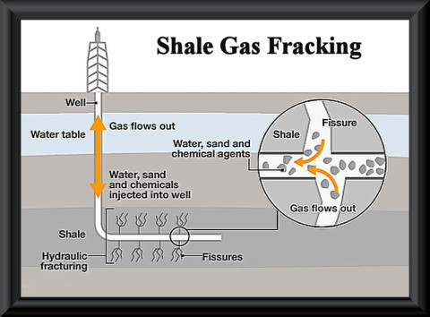

<!---
<style>
.wraptocenter {
  display:inline-block;
  text-align: center;
  vertical-align: middle;
  text-align: center;
  width: 200px;
  height: 200px;
  background-color: #999;
}
.wraptocenter * {
  display:inline-block;
  vertical-align: middle;
  text-align: center;
}
<style/>
-->


## Crude Oil: A Brief History 

The first modern well was drilled in 1859 near Titusville in western Pennsylvania.

- Around the same time, oil was being produced (first by digging then by drilling) in Ontario, Canada.

- Much of this oil was refined into kerosene.

<div class="MIfooter"></div> 


## Lucas Gusher at Spindletop

The Texas oil boom was kicked off in 1901, when oil was found in the Spindletop field in Beaumont, Texas.

<!---
<div class="wraptocenter">
  
</div>
-->


<!---
  
-->


<div class="MIfooter"></div> 

## Prices Through 1973

Crude oil prices didn't fluctuate much prior to 1973.

- A set of U.S. oil companies held the price stable with production controls. These *Seven Sisters*, as they were known, were Anglo-Persian Oil (now BP), Gulf Oil, Jersey Standard Oil (now Exxon), Royal Dutch Shell, Standard Oil of California (now Chevron), Standard Oil of New York (Socony), and Texaco. 

- After the Yom Kippur war in 1973, control of crude oil prices transferred to the Organization of the Petroleum Exporting Countries (OPEC), an inter-governmental organization started in 1960 by Iran, Iraq, Kuwait, Saudi Arabia and Venezuela.  Prices have since become more volatile. 

<div class="MIfooter"></div> 

## Crude Oil Price Benchmarks

Today, three types of oil serve as global benchmarks for other oil prices:

1.  West Texas Intermediate (WTI): the U.S. price benchmark

2.  Brent North Sea: the European price benchmark

3.  Dubai: the Asian price benchmark

<div class="MIfooter"></div> 

## Crude Oil Grades

Crude oil is graded by density (light/heavy) and sulphur content (sweet/sour).  

- Low density (light) and low sulphur (sweet) is cheaper to refine than more heavy and sour crude oil.

-  For example, both WTI and Brent are light sweet crudes (but WTI is lighter and sweeter), whereas Dubai is medium sour.

- For this reason, historically (that is, prior to 2010), WTI has traded at a premium to Brent.  Since 2010, the difference in grade has been more than offset by the supply of crude from North Dakota and the western Canadian provinces. 

<div class="MIfooter"></div> 

## Crude Oil Prices: WTI v. Brent

```{r, echo=FALSE, message=FALSE, warning=FALSE, cache = FALSE}
#{{{
library(EIAdata)
library(quantmod)
library(dygraphs)


renderDygraph({
  key <- source("./key")$value  

  wti <- getEIA("PET.RWTC.M", key = key)
  brent <- getEIA("PET.RBRTE.M", key = key)

  data <- merge.xts(wti, brent, join = "inner")
  names(data) <- c("WTI", "Brent")
  dygraph(data, main = "", ylab = "$") %>%
  dyRangeSelector()
})
#}}}
```

<div class="MIfooter"></div> 

## U.S. Crude Oil Production

The U.S. produces about 8 million barrels of crude per day.  

-  U.S. production has increased since the introduction of technology to extract tight oil (oil from shale formations such as the Bakken formation in western North Dakota).



<div class="MIfooter"></div> 

## U.S. Crude Oil Production

```{r, echo=FALSE, message=FALSE, warning=FALSE, cache = FALSE}
#{{{
library(EIAdata)
library(quantmod)
library(dygraphs)


renderDygraph({
    key <- source("./key")$value  

    USprod <- getEIA("PET.MCRFPUS1.A", key = key) / 1000
    USres <- getEIA("PET.RCRR01NUS_1.A", key = key) 

    data <- merge.xts(USprod, USres, join = "inner")
    names(data) <- c("Production", "Proved Reserves")
    dygraph(data, main = "") %>%
        dyAxis("y", label = "Production:  in million barrels") %>%
            dyAxis("y2", label = "Proved Reserves:  in million barrels", independentTicks = TRUE) %>%
                dySeries("Proved\ Reserves", axis = 'y2') %>%
                    dyRangeSelector()
})
#}}}
```

<div class="MIfooter"></div> 

## U.S. Crude Oil Consumption

The U.S. consumes about 18 million barrels of crude oil per day.  

- Crude oil is primarily refined into gasoline, diesel fuel, and heating oil.  

<div class="MIfooter"></div> 

## U.S. Crude Export Restrictions

Crude oil exports are restricted by the 'Energy Policy and Conservation Act' of 1975, which directs the President “to promulgate a rule prohibiting the export of crude oil” produced in the U.S.  This act was passed after the OPEC embargo.

- Given the recent production increase in the U.S., there is pressure for the President to allow increased exports. 

<!---  crude oil derived from fields under the State waters of Alaska's Cook Inlet; (2) Alaskan North Slope crude oil; (3) certain domestically produced crude oil destined for Canada; (4) shipments to U.S. territories; and (5) California crude oil to Pacific Rim countries. -->

<div class="MIfooter"></div> 

## Crude Oil and the Macroeconomy

In a study from the year 2000, the International Monetary Fund (IMF) [estimated](https://www.imf.org/external/pubs/ft/oil/2000/oilrep.PDF) a \$5 increase in crude oil prices reduces global economic growth by 0.3\% in the following year. 

Also, since crude oil is used in the transport and production of many goods, it is a prominent driver of inflation.

Accordingly, it is closely watched by the Federal Reserve when setting monetary policy.  


<div class="MIfooter"></div> 

## Crude Oil and the Stock Market

Sharp increases in oil prices tend to lower stock prices. 

- Research [has shown](http://econpapers.repec.org/article/eeejfinec/v_3a89_3ay_3a2008_3ai_3a2_3ap_3a307-327.htm) that market participants accurately estimate the effect of higher oil prices on firm cash flows, and so stock prices fall accordingly.  

- Other work [has concluded](http://econpapers.repec.org/article/blajfinan/v_3a51_3ay_3a1996_3ai_3a2_3ap_3a463-91.htm) that oil may even be able to predict *future* stock market returns.  


<div class="MIfooter"></div> 


## Industry Resources

While not an exhaustive list of informative sources, the resources from the U.S. government's Energy Information Administration provided below are commonly referenced by industry players and investors.

-  [*This Week in Petroleum*](http://www.eia.gov/petroleum/weekly/)
-  [*Petroluem Supply Monthly*](http://www.eia.gov/petroleum/supply/monthly/)
-  [*Drilling Productivity*](http://www.eia.gov/petroleum/drilling/)

You might also be intersted in taking a look at the [Baker Hughes rig count](http://phx.corporate-ir.net/phoenix.zhtml?c=79687&p=irol-rigcountsoverview), which has been a standard industry resource since 1944. 

<div class="MIfooter"></div> 


## Credits and Collaboration

Click the following links to see the [code](https://github.com/FinancialMarkets/5MinuteFinance/blob/master/Commodities/crude_oil_markets/oil_markets.Rmd), [line-by-line contributions to this presentation](https://github.com/FinancialMarkets/5MinuteFinance/blame/master/Commodities/crude_oil_markets/oil_markets.Rmd), and [all the collaborators who have contributed to 5-Minute Finance via GitHub](https://github.com/FinancialMarkets/5MinuteFinance/graphs/contributors).

Learn more about how to contribute [here](http://www.5minutefinance.org/how-to-contribute).

<div class="MIfooter"></div> 

